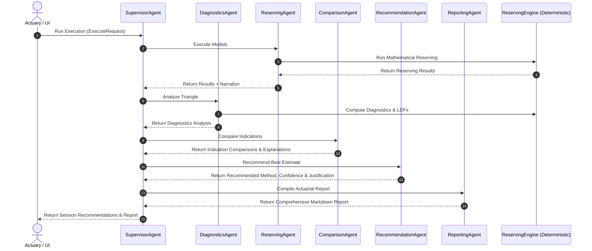

# Multi-Agent Actuarial Intelligence Architecture

This document describes the design and implementation of the AI reasoning layer that sits on top of the deterministic reserving engine.

## Core Design Principles

- **Deterministic Decoupling**: All mathematical calculations (development factors, projections, variance, etc.) are executed exclusively by the deterministic reserving engine. The AI agents are restricted to **reasoning, orchestration, recommendations, explanations, and report generation**.
- **Engine Read-Only**: The actuarial engine remains untouched. Agents consume the engine's public interfaces and standard outputs rather than changing its logic.
- **Specialization**: Large language models (LLMs) perform best when tasked with narrow, specialized contexts. Each agent is modeled as a distinct, specialized component.

---

## Agent Responsibilities

The package `backend/agents/` contains the following components:

### 1. SupervisorAgent (`supervisor.py`)
- **Role**: Entry point and coordinator.
- **Responsibilities**:
  - Receives user intent and controls the pipeline execution flow.
  - Routes sub-tasks to the specialist agents.
  - Aggregates and combines agent responses into unified payloads.
  - Maintains state within the global `SESSION_STORE`.

### 2. DiagnosticsAgent (`diagnostics_agent.py`)
- **Role**: Quality Auditor & Triangle Assessor.
- **Responsibilities**:
  - Runs deterministic diagnostics on the `Triangle` (using `compute_diagnostics` and `DevelopmentEngine`).
  - Evaluates data quality (identifying missing values, duplicates, and anomalies).
  - Performs maturity assessments and reporting pattern diagnostics.
  - Assesses Loss Development Factor (LDF) stability (utilizing Coefficient of Variation - COV).
  - Detects outliers.

### 3. ReservingAgent (`reserving_agent.py`)
- **Role**: Actuarial Execution Auditor.
- **Responsibilities**:
  - Triggers model executions on `ReservingEngine` according to configured assumptions.
  - Audits execution outputs (verifying if runs succeeded or failed).
  - Provides natural language descriptions of the configured assumptions and parameters used.

### 4. ComparisonAgent (`comparison_agent.py`)
- **Role**: Peer Analysis Specialist.
- **Responsibilities**:
  - Compares the numerical results across all successfully executed methods.
  - Calculates deterministic reserve differences, ultimate differences, and loss ratios relative to the median.
  - Uses the LLM to explain why methods differ based on their differing structural and historical sensitivities.

### 5. RecommendationAgent (`recommendation_agent.py`)
- **Role**: Best Estimate Decision Maker.
- **Responsibilities**:
  - Consumes inputs from the `DiagnosticsAgent`, `ReservingAgent`, and `ComparisonAgent`.
  - Determines the recommended reserving method (e.g. Chain Ladder vs. Bornhuetter-Ferguson).
  - Assigns an actuarial confidence score (High/Medium/Low).
  - Produces a detailed justification referencing objective diagnostic findings (e.g., LDF stability, tail factors, maturity).
  - Details cautions, warning flags, and alternative methods.

### 6. ReportingAgent (`reporting_agent.py`)
- **Role**: Actuarial Report Compiler.
- **Responsibilities**:
  - Compiles the outputs of all preceding agents into a formal, comprehensive actuarial report in Markdown format.
  - Structuring includes: Executive Summary, Actuarial Report (Methodology), Assumption Summary, Diagnostics Summary, and Recommendation Summary.
  - Markdown output is structured to be suitable for future PDF generation.

---

## Interaction Diagram

The following Mermaid diagram outlines the interaction flow during model execution and recommendation generation:



---

## Tool Usage & Data Flow

The table below outlines the specific actuarial tools and classes consumed by each agent:

| Agent | Actuarial Tool/Library Consumed | Key Outputs |
| :--- | :--- | :--- |
| **SupervisorAgent** | `SESSION_STORE` | Session workflow state updates, JSON event streams |
| **DiagnosticsAgent** | `Triangle`, `compute_diagnostics`, `DevelopmentEngine` | Data quality flags, maturity scores, LDF stability assessment |
| **ReservingAgent** | `ReservingEngine` | Executed method results, validation checks |
| **ComparisonAgent** | None (Consumes Reserving results) | Relative differences, median comparisons, variation analysis |
| **RecommendationAgent** | None (Consumes Diagnostics & Comparison outputs) | Recommended method, confidence levels, cautions, alternatives |
| **ReportingAgent** | None (Consumes preceding outputs) | Complete Markdown actuarial report |

### Data Flow Process (Diagnostics-Driven Selection):

1. **Deterministic Diagnostics**: The `DiagnosticsAgent` runs modular diagnostics (`reporting_pattern`, `ldf_stability`, `calendar_effects`, `tail_analysis`, `outliers`, and `suitability`).
2. **Supervisor Decision Intelligence**: The `SupervisorAgent` analyzes the diagnostic outputs and makes routing decisions:
   - **Quality Check**: Stops pipeline execution and prompts user intervention if critical quality issues are found.
   - **Volatility Routing**: Prioritizes `MCL` (Mack) and prompts comparison against `BF` if LDF volatility is high.
   - **Premium Dependency**: Skips and disables premium-dependent methods (`BF`, `BK`, `CC`, `ELR`) if premium is missing.
   - **Fit Check**: Triggers warnings and lowers confidence in development methods if reporting pattern curve fit is poor.
3. **Specialist Evaluation**:
   - `ReservingAgent` fits eligible mathematical models.
   - `ComparisonAgent` determines differences relative to median.
4. **Recommendation and Trace**: `RecommendationAgent` evaluates the suitability scores and qualitative evaluations. It chooses the recommended method, and generates a deterministic `decision_trace` explaining the steps from raw diagnostics to the chosen best estimate.
5. **Report Compilation**: `ReportingAgent` compiles the final report, integrating the trace and cautions.

5. **Chat Conversation**: The generated report and diagnostics are saved in `SESSION_STORE`. When the user asks questions, the chatbot reads this context to provide responses referencing Jacqueline Friedland's methodologies.

---

## Extension Guide: Adding a Specialist Agent

To add a new specialist agent (e.g. `SensitivityAgent` to analyze how changes in tail factors affect the IBNR):

1. **Create the Agent File**:
   Create `backend/agents/sensitivity_agent.py` and define a class:
   ```python
   from agents.utils import run_agent, parse_json_response

   class SensitivityAgent:
       def __init__(self, api_key=None, base_url=None, model_name=None):
           self.api_key = api_key
           self.base_url = base_url
           self.model_name = model_name

       def analyze_sensitivity(self, base_results, sensitivity_results):
           # deterministic comparisons...
           # LLM analysis...
           return sensitivity_summary
   ```

2. **Expose in Package**:
   Add it to `backend/agents/__init__.py`:
   ```python
   from .sensitivity_agent import SensitivityAgent
   ```

3. **Orchestrate in Supervisor**:
   In `backend/agents/supervisor.py`, import the agent, instantiate it in `generate_recommendation_and_report`, call it, and save its results to the session.
