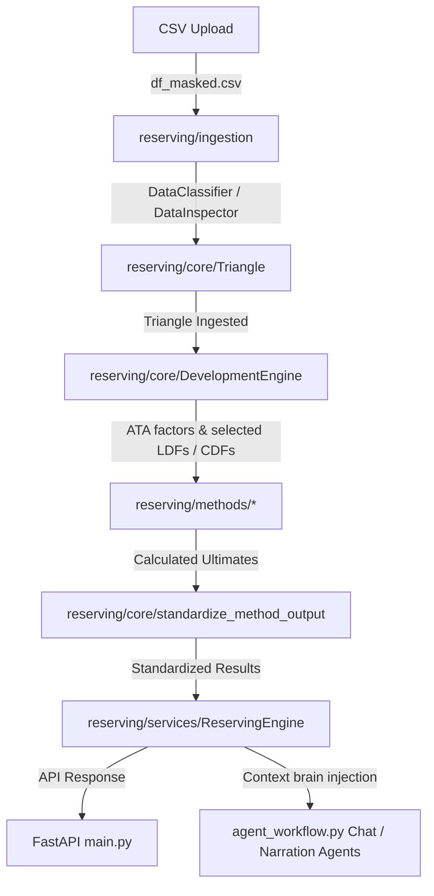

# Actuarial Reserving Platform — System Architecture

This document outlines the final system architecture, package responsibilities, dependency rules, and key data flows for the Actuarial Reserving Platform.

---

## 1. Final Project Structure

```
c:\Reserving-using-Agentic-AI\
├── backend/
│   ├── reserving/
│   │   ├── core/                    # Core actuarial domain models & calculations
│   │   │   ├── __init__.py          # Core namespace exports (Triangle, OnLevelPremiumCalculator, etc.)
│   │   │   ├── assumptions.py       # LDF selection methods
│   │   │   ├── averages.py          # Actuarial column averages (Simple, Volume Weighted, Geometric, Medial)
│   │   │   ├── cdfs.py              # CDF backward multiplication
│   │   │   ├── development.py       # Age-to-age (ATA) individual factor calculation
│   │   │   ├── development_engine.py# Development engine orchestration API
│   │   │   ├── on_level.py          # Parallelogram method on-level premium calculations
│   │   │   ├── reserves.py          # Standard reserve, case outstanding, and IBNR formulas
│   │   │   ├── tools.py             # Actuarial helpers (maturity, custom tail factors, availability tables)
│   │   │   └── triangle.py          # Triangle object parser, pivot tables, and builder
│   │   ├── diagnostics/             # Analytical computation logic
│   │   │   ├── __init__.py          # Diagnostics namespace exports
│   │   │   └── diagnostics.py       # CoV, loss ratios, stability, and volume trend diagnostics
│   │   ├── ingestion/               # File parsers & data inspectors
│   │   │   ├── __init__.py
│   │   │   ├── classifier.py        # Schema layout classification (long, wide, policy, claims)
│   │   │   └── inspector.py         # Multi-entity groups, Reserving Roles mapping, and data inspectors
│   │   ├── methods/                 # Mathematical implementation of reserving methods
│   │   │   ├── __init__.py          # Methods catalog definition (METHODS mapping)
│   │   │   ├── base.py              # Abstract base class for reserving methods (MethodBase)
│   │   │   ├── benktander.py
│   │   │   ├── bf.py                # Bornhuetter-Ferguson
│   │   │   ├── cape_code.py         # Cape Cod
│   │   │   ├── case_outstanding.py
│   │   │   ├── cl.py                # Chain Ladder
│   │   │   ├── clark.py             # Clark LDF / Cape Cod stochastic models
│   │   │   ├── elr.py               # Expected Loss Ratio
│   │   │   ├── frequency_severity.py
│   │   │   └── mack.py              # Mack Chain Ladder (volatility & standard errors)
│   │   ├── schemas/                 # Data model validation schemas
│   │   │   ├── __init__.py          # Schemas exports
│   │   │   └── reserving.py         # Pydantic schemas (MethodConfig, ExecuteRequest)
│   │   └── services/                # Business logic orchestrators
│   │       ├── __init__.py          # Services exports
│   │       └── reserving_engine.py  # Orchestrates execution, defaults, tail factors, and standardization
│   ├── main.py                      # FastAPI server endpoints & controller
│   ├── agent_workflow.py            # Universal OpenAI client & parallel AI agent execution pipeline
│   └── test_*.py                    # Verification and benchmark test scripts
├── data/                            # Test and validation CSV datasets
├── frontend/                        # Frontend UI assets (HTML, Tailwind CSS, JS)
└── docs/                            # Platform documentation
    └── ARCHITECTURE.md              # System Architecture (This file)
```

---

## 2. Package Responsibilities

* **`reserving/core/`**: Holds the fundamental domain entities and low-level mathematical operations. It is responsible for parsing raw inputs, converting formats, computing simple LDF averages, and calculating standard reserve decompositions (`Reserve = Ultimate - Paid`, `IBNR = Ultimate - Incurred`).
* **`reserving/ingestion/`**: Sanitizes, classifies, and maps uploaded CSV data. It detects column mappings, resolves reserving roles (e.g. mapping `CumPaidLoss_C` to `paid_col`), and determines whether the data contains multiple entities or specific formatting styles.
* **`reserving/methods/`**: Houses the concrete mathematical classes implementing actuarial techniques. Every method inherits from `MethodBase` and must implement `.fit()` and returns ultimate estimates per accident year.
* **`reserving/diagnostics/`**: Computes data stability, credibility indices, volume growth trends, and suggested a priori expected loss ratios to provide the user (and AI agents) with descriptive context.
* **`reserving/services/`**: Coordinates execution. `ReservingEngine` maps incoming requests, resolves parameter defaults, processes tail factors, runs models concurrently, and standardizes their outputs.
* **`reserving/schemas/`**: Enforces strict API boundaries using Pydantic models for incoming method configs.

---

## 3. Dependency Rules

To prevent spaghetti architecture and circular imports, the following strict dependency boundaries are enforced:

1. **Downward Flow Only**: Services can import from `methods`, `schemas`, and `core`. Concrete reserving methods can import from `core`. Core modules MUST NOT import from `services` or `methods`.
2. **Standardization Separation**: Results standardization is a bridge between core models, method results, and services. It resides in `reserving/core/standardizer.py` and is consumed by `reserving/services/reserving_engine.py`.
3. **No AI in Calculations**: Actuarial math must run strictly deterministically in Python. The LLM (in `agent_workflow.py`) consumes the resulting outputs for narration and recommendations but does not perform calculations.

---

## 4. Platform Data Flow



1. **Upload**: User uploads a CSV.
2. **Ingestion & Classification**: `DataClassifier` fingers the format (long/wide); `DataInspector` maps columns to `origin_col`, `dev_col`, `paid_col`, etc.
3. **Triangle Construction**: `Triangle` parses the file and builds the 2D paid, incurred, and count matrices.
4. **Development Engine**: `DevelopmentEngine` calculates individual age-to-age factors, averages them, and computes CDFs.
5. **Reserving Methods**: Selected reserving methods (e.g. `ChainLadder`, `Benktander`) execute their specific algorithms using the CDFs and triangle data to project ultimate losses.
6. **Standardization**: `standardize_method_output` clamps negative IBNR, verifies the identities, and maps the results to a uniform JSON shape.
7. **Orchestration**: `ReservingEngine` compiles all method results, runs AI recommendations, and returns the final JSON response to `main.py`.

---

## 5. Guidelines for Adding New Reserving Methods

To add a new reserving method to the platform, follow this step-by-step checklist:

1. **Create the Method File**: Create `new_method.py` inside `backend/reserving/methods/`.
2. **Inherit from `MethodBase`**: Implement a class inheriting from `MethodBase` (defined in [base.py](file:///c:/Reserving-using-Agentic-AI/backend/reserving/methods/base.py)).
3. **Define Class Attributes**:
   - `code`: Unique string identifier (e.g., `"MCL"`, `"BF"`).
   - `label`: Human-readable name.
   - `requires_paid_triangle`: Boolean.
   - `requires_incurred_triangle`: Boolean.
   - `needs_premium`: Boolean.
4. **Implement the `.fit()` Method**:
   ```python
   def fit(self, triangle, params: dict, custom_ldfs: list = None):
       # 1. Initialize result structure
       # 2. Extract necessary diagonals and parameters
       # 3. Compute ultimate projection
       # 4. Save results to self.results list of dicts:
       #    [{'ay': ay, 'ultimate': u, 'cdfToUlt': cdf, 'pctReported': pct}, ...]
   ```
5. **Register the Method**: Add your class import and code mapping to the `METHODS` dictionary in [backend/reserving/methods/\_\_init\_\_.py](file:///c:/Reserving-using-Agentic-AI/backend/reserving/methods/__init__.py).
6. **Enable in Frontend**: Update `frontend/app.js` configuration checkboxes/parameters if any custom user inputs are needed for the method.
